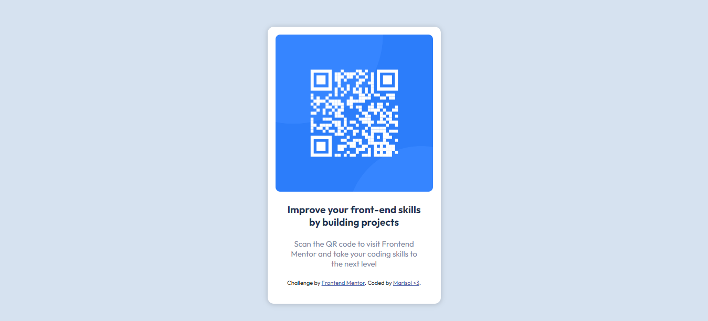
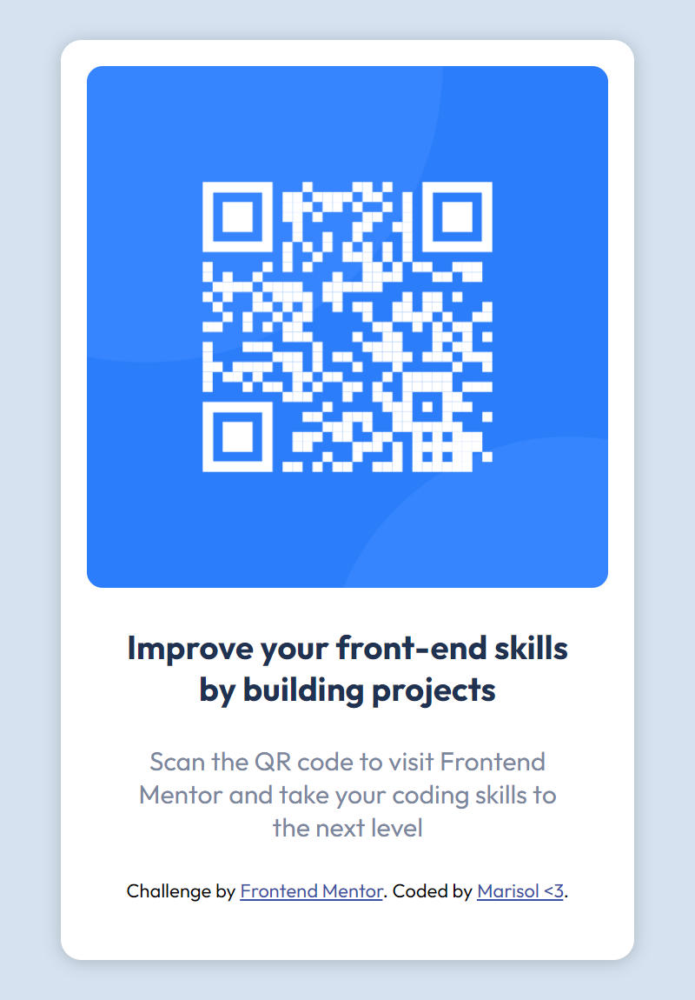

# Frontend Mentor - QR code component solution

This is a solution to the [QR code component challenge on Frontend Mentor](https://www.frontendmentor.io/challenges/qr-code-component-iux_sIO_H). Frontend Mentor challenges help you improve your coding skills by building realistic projects. 

## Table of contents

- [Overview](#overview)
  - [Screenshot](#screenshot)
  - [Links](#links)
- [My process](#my-process)
  - [Built with](#built-with)
  - [What I learned](#what-i-learned)
  - [Continued development](#continued-development)
- [Author](#author)


## Overview
  This was harder than i imagined so i struggled a bit but in the end i think its a bit ok.
  A very simple card wiht an image and a text. 

### Screenshot




### Links

- Solution URL: [Add solution URL here](https://your-solution-url.com)
- Live Site URL: [Add live site URL here](https://your-live-site-url.com)

## My process
 1 . The first step was to analize what i had to do 
 2 . I checked the html code
 3 . I added what i think was needed
 4 . Style.
 5 . Tried to make it look good.
### Built with

- Semantic HTML5 markup
- CSS custom properties
- Flexbox
- CSS Grid

### What I learned
I learned (again) about css, flex and grid.

```

### Continued development

Im not sure if what im doing is the best form to work with. I want to improve that.


## Author: 

- Website - [Marisol Vargas](https://www.github.com/katherina-00)
- Frontend Mentor - [@katherina-00](https://www.frontendmentor.io/profile/katherina-00)
- Linkedin - [Marisol Vargas](https://www.linkedin.com/in/marisol-vargas-in/)

